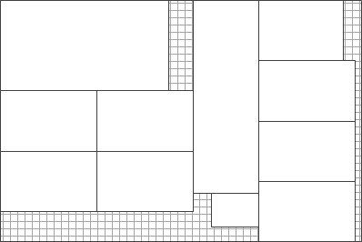
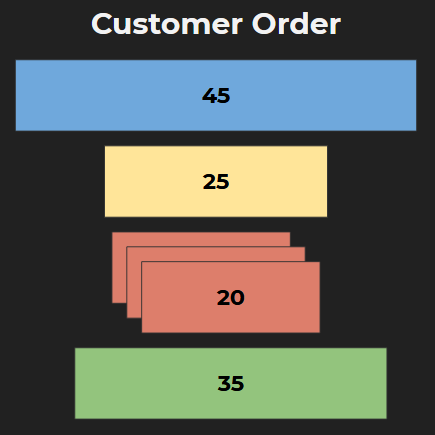
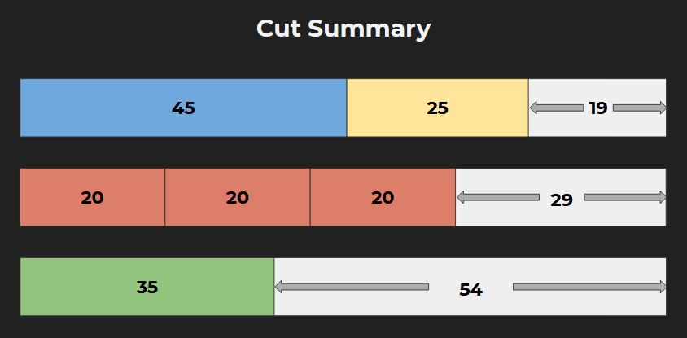
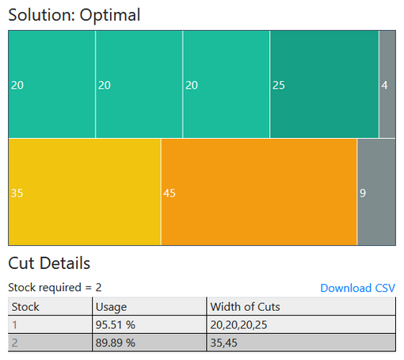

If you have seen wide Paper or Fabric Rolls cut into smaller width rolls, or cutting of big metal rods 

You might have wondered:
> ### How many ways there are to cut a big stock item into small pieces of required lengths?
The answer is: Too many ways

Perhaps a better question is:
> ### How to cut required small pieces from the stock item so that waste is minimum?

Another question you could ask:
> ### How to cut the required small pieces from the stock item so that minimum possible stock items are used?


All these questions are address the name Cutting Stock Problem and it is studied under a sub-field of Applied Mathematics called Operations Research. People in Metal, Glass, Paper and Textile industry deal with this problem everyday.


## 1D vs 2D Cutting Stock Problem
If each next piece that we want requires a single cut to get, it's called 1D or One Dimensional Cutting Stock Problem. Examples include cutting of Paper Rolls, Fabric Rolls and Metal Rods.


If the cutting involves a rectuangular sheet cut into small rectangular sheets of required sizes, it's called 2D or Two Dimensional Cutting Stock Problem
Examples includes Cutting of Glass Sheets and Metal Sheets.



This article discusses 1D Problem in depth and in the next article, we'll discuss the 2D Problem.
For the sake of example, let us assume that we have standard rods of size 89 cm in our stock.


A customer order arrives and it says: They need:
1 rod of 45 cm, 1 of 25 cm, 3 rods of 20 cm and 1 of 35 cm



## Cutting without a plan
We immediately start cutting. We don't think of rearranging the rods and we cut them in the manner that they were mentioned in the customer order.

From 1st Stock rod, we cut: 45 cm & 25 cm and we are left with 19 cm which does not satisfy any of our customer demands.

We move to the next rod for cutting. we cut: 20 cm, another 20 and another 20, we are left with 29 cm. Our last required rod is 35 cm that cannot be cut from 29 cm so we have to cut another stock rod

We start cutting the 3rd rod. we cut: 35 cm and we are left with 54 cm

So with no planning for cuts, we ended up using 3 stock rods to satisfy the customer demand and our leftover is 19 cm, 29 cm and 54 cm. We might be able to use the leftover 29 and 54 cm rods in some future orders but 19 cm leftover will most likely go to waste because seeminly no customer needs rods less 20 cm.


This no planning for cuts approach is certainly not ideal. What if the next order requires a 60 cm rod. We cannot satisfy that with 29 and 54 cm rods.

So, is there a way to satisfy this customer demand So that we use minimum possible stock rods? and our waste is minimum too?


## CSP Tool - to plan the cuts
Let us plan for cuts with the help a tool. I designed this simple tool to solve Cutting Stock Problem which is free to use and available at 

> ### https://alternate.parts/csp

This CSP Tool can plan both 1D and 2D Cutting Stock Problem. (The 2D part is not complete yet.)

Let us focus on 1D tool which helps us in finding an optimal plan to cut your stock rods or stock fabric rolls so that minimum possible stock is used and waste is minimum too.


Here you see 2 tables. 
In the top table, you specify the details of customer rods to cut. In the bottom table, you enter stock rods details. 

Notice that you cannot specifiy the quantities of the stock rods for now. Actually this tool will tell you how many stock rods will be required to completely satisfy this demand.

But I might add this feature soon so that you could limit the number stock rods to be used and satisfy maximum possible customer demand while staying in the limit.

Let's enter the sizes of customer rolls in the top table
45 - 1
25 - 1
20 - 3
35 - 1

Enter size of stock rods in the bottom table: 89

Notice that you don't need to write the units like cm or inch. You only specifiy size. click "Cut". You can see the plan:


In the diagram on the right, we see the plan of how to cut the rods. Each row specifies 1 stock rod and each box represents 1 small customer rod. Rods with same width or size have same color. And the blackish color specifies the waste  or the leftover part of stock rod.

In the bottom right table, we can see the Usage or Utilization of each stock rod. 1st was utilized 95.5% and 89.9% of the 2nd was used. And here is the details of the cuts. You can also download these cut details as a CSV file and import to Microsoft Excel. Or simply copy and paste to Google sheets.

## How it works
Let us see how CSP Tool works behind the scenes
It uses Google's OR-Tools library which is a fantastic library to solve problems like Cutting Stock Problem.

```bash
$ pip install ortools
```

OR-Tools is very straightforward to use. You specify the variables. Variables will contain the result of your problem. In our case, they will contain the number of stock rods used and the plan of cutting
```py
  # array of boolean declared as int, if y[i] is 1, 
  # then y[i] Big roll is used, else it was not used
  y = [ solver.IntVar(0, 1, f'y_{i}') for i in range(k[1]) ] 

  # x[i][j] = 3 means that small-roll width specified by i-th order
  # must be cut from j-th order, 3 tmies 
  x = [[solver.IntVar(0, b[i], f'x_{i}_{j}') for j in range(k[1])] \
      for i in range(num_orders)]
  
  unused_widths = [ solver.NumVar(0, parent_width, f'w_{j}') \
      for j in range(k[1]) ] 
  
  # will contain the number of big rolls used
  nb = solver.IntVar(k[0], k[1], 'nb')
```

Then you specify constraints. Constraints are limits within which, your algorithm must find a solution. In our case the constraints are that
1. All the customer orders must be satisfied
```py
  # consntraint: demand fullfilment
  for i in range(num_orders):  
    # small rolls from i-th order must be at least as many in quantity
    # as specified by the i-th order
    solver.Add(sum(x[i][j] for j in range(k[1])) >= demands[i][0]) 
```

2. And Sum of sizes of small rods cut from a big stock rod cannot exceed the size of the big rod.
```py
  # constraint: max size limit
  for j in range(k[1]):
    # total width of small rolls cut from j-th big roll, 
    # must not exceed big rolls width
    solver.Add( \
        sum(demands[i][1]*x[i][j] for i in range(num_orders)) \
        <= parent_width*y[j] \
      )
```

And then specify the objective. The objective is what is your main goal with this algorithm. Like our goal with CSP is to minimize the number of stock items used.
```py
  Cost = solver.Sum((j+1)*y[j] for j in range(k[1]))

  solver.Minimize(Cost)
```

The code for this algorithm is available at on [GitHub](https://github.com/emadehsan/csp)
I will put this link in the description.

## Don't know programming? No worries!
If you don't understand this programming part, no worries. You don't need to know programming to use the CSP Tool.

Just a reminder that CSP Tool is free to use and available at [alternate.parts/csp](https://alternate.parts/csp)

### Known issues/
There are a few limitations with this tool at the moment
* It only works with natural numbers. That is it does not work with decimal part
* There is some bug in the code which will be fixed soon, but it introduces some extra small items in the result. If that happens to your results, the CSP Tool will alert you about it and you can exclude those items


## Further Readigns
## Google's OR Tools
[Google's OR Tools](https://developers.google.com/optimization) library was used in making this tool. They have great tutorials and examples that are easy to follow without any background in Operations Research. It is available for Python, C++, Java and C#.

### Practical Python AI Projects
I also learned a lot from Professor Serge Kruk's book: "Practical Python AI projects"
It is very easy to understand and totally recommended. In fact most of the code used in our CSP Tool is taken from this book.

The 2D Cutting Stock Problem is even more interesting and challenging to solve. See you next time with 2D CSP. :)

https://raw.githubusercontent.com/emadehsan/emadehsan.github.io/master/_posts/2020-01-29-object-detection.md

https://emadehsan.com/p/object-detection
[TODO put link to book's Amazon]